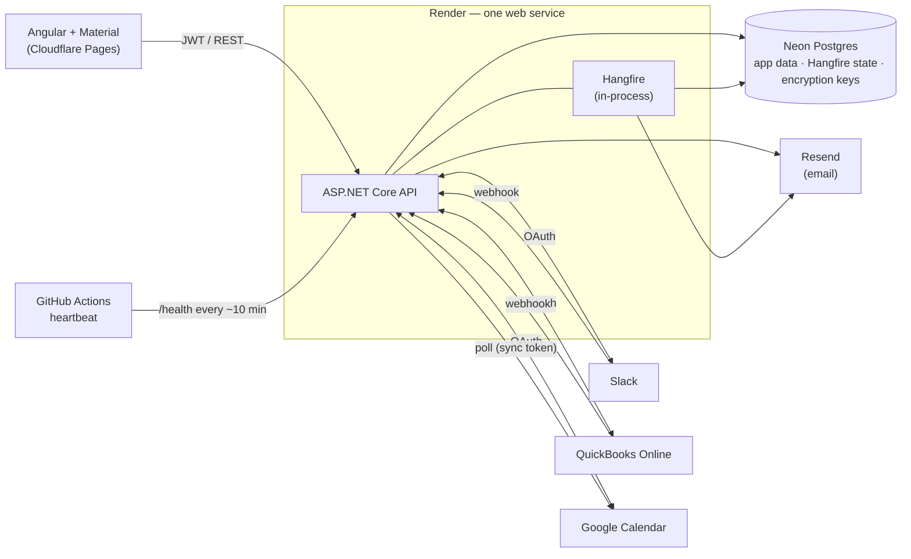

# Workflow Automation & Reporting Dashboard

**A focused, self-serve automation tool for solo business owners** — connect Slack, QuickBooks Online, and Google Calendar, build simple "if this, then that" automations between them, and get a scheduled weekly summary of your week emailed automatically. A small, well-built mini-Zapier for everyday admin.


### ▶ [Try the live demo](https://workflow-automation-dashboard.pages.dev) — no signup

The demo opens on a populated account: real connections, a week of activity, and a sample report. Hit **Test run** on any automation and watch the activity log update live; hit **Generate now** to produce a weekly report on the spot. The demo is read-only, so explore freely.

---

## What it does

You connect the tools you already use, then build automations one trigger and one action at a time. Each action can pull live data from the trigger using `{{ }}` placeholders. Three real examples:

- **Invoice paid → Slack** — when an invoice is marked paid in QuickBooks, post `💰 {{invoice.customer}} paid {{invoice.total}}` to your `#finance` channel.
- **Invoice created → Email** — when a new invoice is created, email yourself a copy with the number and customer.
- **New meeting → Slack** — when an event lands on your Google Calendar, post `📅 Upcoming: {{event.title}}` so the team sees it.

On top of automations, a **weekly report** gathers your week — meetings booked, invoices raised and still unpaid, channel activity — renders it to HTML, and emails it on the day and time you choose, in your timezone.

---

## Key features

- **Multi-provider OAuth** — connect Slack, QuickBooks Online, and Google Calendar through real OAuth 2.0 flows, with tokens encrypted at rest.
- **Visual automation builder** — trigger → optional filter → action, with a data-driven form that knows each provider's available fields and template tokens.
- **Reliable background execution** — automations run on a Hangfire worker with auto-retry, and every run is logged with its payload, result, and timing in a full activity log.
- **Idempotent processing** — webhook deliveries are de-duplicated so a redelivered event never fires an automation twice.
- **Token lifecycle handling** — proactive refresh, refresh-token rotation (QuickBooks), and expiry detection that flags a connection for reconnect rather than silently failing.
- **Scheduled reporting** — timezone-aware weekly digests emailed via Resend, plus an on-demand "Generate now".
- **Read-only demo mode** — a seeded account anyone can explore without signing up.
- **Zero monthly cost** — every service runs on a sustainable free tier.

---

## Architecture

A clean monolith: one Angular SPA, one ASP.NET Core API with Hangfire running **in-process**, one Postgres database. No microservices — the complexity here is in the integrations and the execution engine, not the topology.



**Why it's shaped this way.** The free hosting budget allows one always-on process, so Hangfire runs inside the API rather than as a separate worker, and an external heartbeat pings `/health` every ~10 minutes to keep the single service warm (and the demo instant on click). Triggers arrive by **signature-verified webhook** where the provider supports it reliably (Slack, QuickBooks) and by **scheduled poll** where it doesn't (Google Calendar, using a stored sync token).

| Layer           | Choice                                                                              |
| --------------- | ----------------------------------------------------------------------------------- |
| Frontend        | Angular (standalone components, signals) + Angular Material → Cloudflare Pages      |
| Backend         | ASP.NET Core (.NET 10), EF Core, Minimal APIs grouped by domain                     |
| Background jobs | Hangfire (in-process), state in Postgres                                            |
| Database        | Neon Postgres                                                                       |
| Auth            | ASP.NET Core Identity + JWT; OAuth 2.0 per provider                                 |
| Email           | Resend                                                                              |
| Hosting         | Cloudflare Pages (web) · Render free web service (API) · GitHub Actions (heartbeat) |

---

## Notable engineering decisions

- **Encrypted tokens that survive redeploys.** OAuth tokens are encrypted at rest with ASP.NET Core Data Protection. The encryption key ring defaults to the local filesystem, which is ephemeral on free hosting — so the keys are persisted to Postgres. Without that, every stored token would become undecryptable after the first redeploy. Tokens also live in their own entity, so they're never pulled into list queries by accident.

- **Idempotency over exactly-once.** Webhooks return `200` immediately and enqueue the slow work, so providers don't time out and retry. Each event carries an idempotency key, and the processor de-duplicates on it — honest at-least-once delivery with de-dupe on processing, rather than pretending to guarantee exactly-once.

- **Correct HTTPS scheme behind a proxy.** The API sits behind Render's TLS-terminating proxy, which forwards plain HTTP. OAuth requires the redirect URI sent at authorize time to byte-match the one sent at token exchange — so forwarded headers are honored to reconstruct the original `https` scheme. Miss this and OAuth works locally but breaks in production.

- **Cross-origin auth without a custom domain.** Frontend and API are on different origins, so the access token is held in memory by the SPA and the refresh token in an `HttpOnly`, `SameSite=None` cookie scoped to the auth endpoints — the long-lived secret is never reachable from JavaScript.

- **The Google testing-mode reality, handled honestly.** Google's calendar scope requires app verification, and unverified test-mode authorizations expire weekly. Rather than hide this, the app detects the expiry, flags the connection as _needs reconnect_, disables its dependent automations, and surfaces a reconnect prompt — exactly what a mature production app does. The always-on public demo leans on the stable-token providers so nothing decays.

---

## Scope

**In:** email/password accounts; connect/disconnect Slack, QuickBooks (sandbox), Google Calendar via real OAuth; single trigger → optional filter → single action automations with test runs and a full run log; configurable weekly reports with generate-now; a dashboard home; a seeded demo.

**Deliberately out (considered, deferred):** multi-step chains and branching; multi-tenancy/teams; writing back to QuickBooks; billing; production Google verification; a mobile app. The boundaries are intentional — the goal is a small thing built well, not a broad thing built thin.

---

## Run it locally

You'll need the .NET 10 SDK, Node, and a Neon (or local) Postgres database.

```bash
# API
cd src/WorkflowAutomation.Api
dotnet user-secrets set "ConnectionStrings:Default" "<your Neon connection string>"
dotnet user-secrets set "Jwt:SigningKey" "<a long random secret>"
dotnet run            # migrations run on startup; the demo account seeds automatically
```

To exercise the integrations you'll also set per-provider OAuth credentials (`Slack:ClientId/ClientSecret`, `QuickBooks:ClientId/ClientSecret`, `Google:ClientId/ClientSecret`) and a `Resend:ApiKey`, all via `dotnet user-secrets`. Each provider's redirect URI must point at `https://localhost:<port>/api/connections/<provider>/callback`.

```bash
# Frontend
cd src/workflow-automation-web
npm install
npm start             # serves on http://localhost:4200
```

The Hangfire ops dashboard is available at `/hangfire` (key-protected in production).

---

## Project structure

A single API project organized into domain folders that are the architectural boundaries:

```
src/WorkflowAutomation.Api/
  Identity/        users, JWT issue/refresh/rotate, auth endpoints
  Connections/     OAuth providers, encrypted token storage, connect/reconnect
  Automations/     catalog, builder validation, execution engine, run log
  Reporting/       schedules, data gathering, HTML render, email delivery
  Infrastructure/  persistence, email, demo seeder, scheduling
src/workflow-automation-web/   Angular SPA
docs/design.md     full design & scope document
```

---

## About

Built by **Jason Davids**, a full-stack developer based in Cape Town, South Africa. This is one of a set of portfolio projects exploring production-grade integration, automation, and deployment patterns end to end.

- GitHub: [github.com/JasonD21](https://github.com/JasonD21)
- LinkedIn: [linkedin.com/in/jason-davids-09aa201b0](https://www.linkedin.com/in/jason-davids-09aa201b0/)

---
